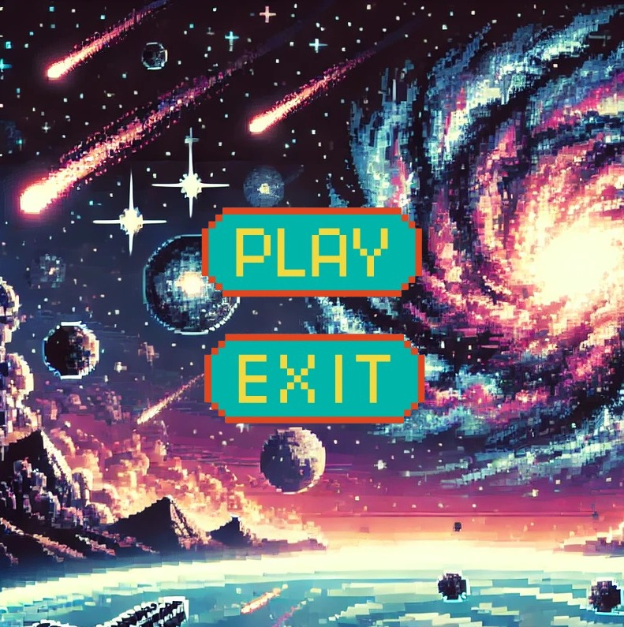
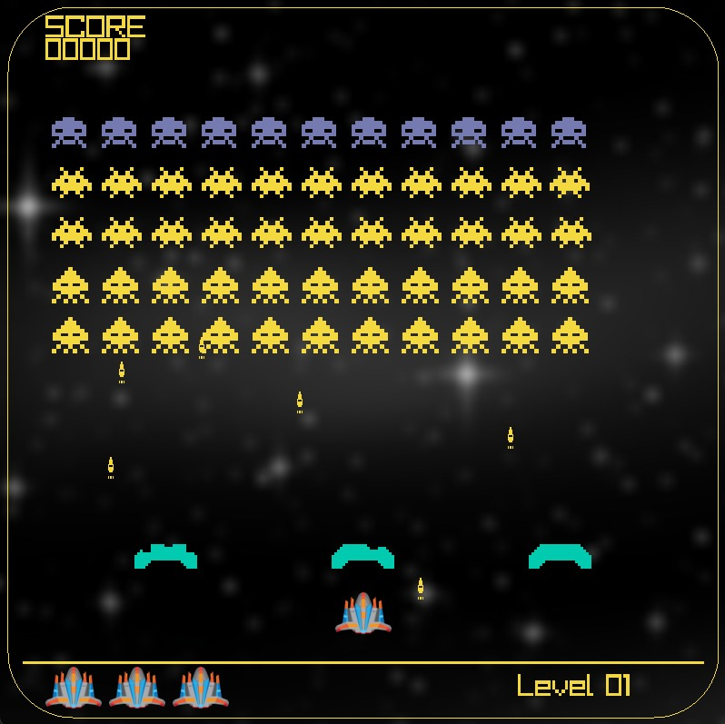
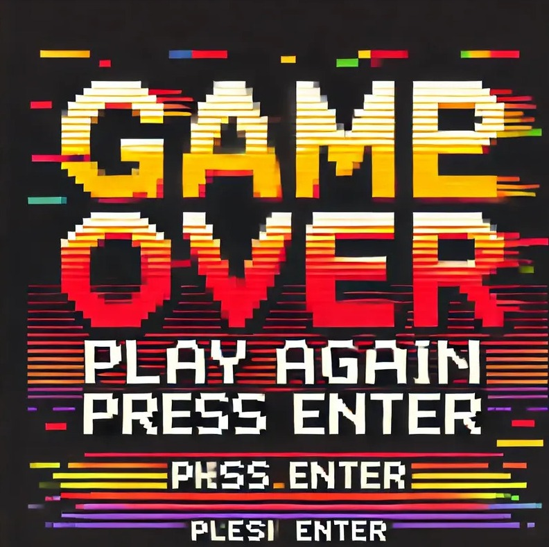

# 🚀 SpaceWar - The Ultimate Space Shooter! 🌌

**SpaceWar** is an exhilarating 2D space shooter game crafted with [raylib](https://www.raylib.com/), a powerful C++ game development library. Take control of a spaceship, battle relentless enemy waves, and survive the cosmic chaos in this action-packed adventure!

---

## 🎮 Game Features

- 🚀 **Dynamic Spaceship**: Master movement and shooting mechanics.
- 👾 **Varied Enemies**: Face foes with unique behaviors.
- 🎨 **Stunning Graphics**: Custom sprites bring the game to life.
- 🔊 **Immersive Audio**: Enjoy sound effects and background music.
- 🕹️ **Intuitive Controls**: Navigate with keyboard inputs.
- ⚡ **Powered by raylib**: Built with a robust C++ library.

---

## 📂 How to Get Started

Run the game manually from source using your preferred C++ IDE (e.g., Visual Studio, VS Code, or CLion).

### 🪐 Step-by-Step Installation

1. **Clone the Repository**:
   ```bash
   git clone https://github.com/xAndReWxx/SpaceWar2.0.0.git
   ```

2. **Open the Project**:
   - Navigate to the project folder:
     ```
     SpaceWar2.0.0/
     ```
   - Open `SpaceWar2.0.0/src/main.cpp` in your IDE.

3. **Build and Run**:
   - Compile and execute `main.cpp`.
   - 📌 **Prerequisite**: Ensure [raylib](https://www.raylib.com/) is installed and properly linked before building.

---

## 📸 Screenshots

### **Start Game**



### **Game Play**



### **End Game**




---

## 🧱 Project Structure

```
SpaceWar2.0.0/
├── src/           → 🎯 Game source files (e.g., main.cpp, game logic)
├── Graphics/      → 🖼️ Sprite images
├── Sounds/        → 🎵 Sound effects & background music
├── lib/           → 📚 External libraries (e.g., raylib)
├── screenshots/   → 📸 Gameplay screenshots
├── Makefile       → 🛠️ Optional build script
└── README.md      → 📖 Project documentation
```

---

## 👨‍💻 OOP Concepts in Action

- **Encapsulation**: Game entities like `Player`, `Enemy`, and `Bullet` are wrapped in classes with private data and public methods.
- **Abstraction**: Objects hide complex internals, exposing simple interfaces (e.g., `Update()`, `Draw()`).
- **Inheritance**: Shared functionality is inherited from base classes like `Entity` or `GameObject`.
- **Polymorphism**: Base pointers or virtual functions enable flexible object handling.

---

## 🧠 Design Patterns Utilized

- **Singleton Pattern**: Manages global resources (e.g., audio or game state).
- **Factory Pattern**: Creates objects like enemies or bullets dynamically.
- **State Pattern**: Switches between game states (Menu, Playing, Paused, Game Over).

---

## 🧑‍💻 Controls

| Key          | Action         |
|--------------|----------------|
| Arrow Keys / WASD | Move spaceship |
| Spacebar     | Shoot          |
| ESC          | Exit game      |

---

## 🛠️ Requirements

- **Compiler**: C++17-compatible (e.g., G++, Clang, MSVC)
- **Library**: [raylib](https://www.raylib.com/) installed
- **IDE**: Visual Studio, VS Code, or any C++ editor

---

## 📝 License

This project is open-source under the **MIT License**. Feel free to use, modify, and distribute!

---

## 🙏 Credits

Inspired by existing tutorials and ideas. All credits go to the original authors where applicable. Thank you for the community support!

---

## 🤝 Contribute

- Fork the repository!
- Enhance the code or add features.
- Submit pull requests to join the development journey!